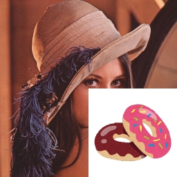
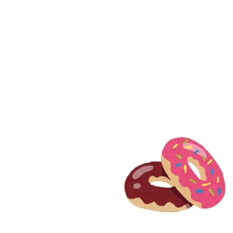
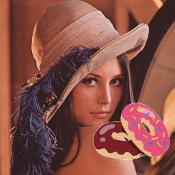

# Advanced program

## Objectives
This page contains challenges using all the techniques you have learned.

## Prerequisite
- You have to finish [basic(2)](../basics/basics_02.md).
- You have to finish [MediaPipe Face](../mediapipe/face.md).

## Challenge[Upon the another image]
### Step1
- Download [`donuts.png`](../image/donuts.png), and save it in `imgs` folder.
- The following `upon_image1.py` is a sample that is drawn another image upon the original image.
  ```python
  # -*- coding: utf-8 -*-
  import cv2
  import numpy as np

  def main():
      img = cv2.imread('./imgs/lena.jpg')
      fimg = cv2.imread('./imgs/donuts.png')

      print("Lenna:", img.shape)
      print("donuts:", fimg.shape)

      img[256:512, 256:512] = fimg

      cv2.imshow("mask", img)

      cv2.waitKey(0)
      cv2.destroyAllWindows()

  # run---------------------------------------------------------------------------------------
  if __name__ == '__main__':
      main()
  ```
- You can see the image size of `lena.jpg` as 512 x 512 pixels. And you can see the image size of `donuts.png` as 256 x 256 pixels.
- In `upon_image1.py`, it is considered that `donuts.png` is drawn upon the right-bottom of `lena.jpg`.
- The size of both images has to be the same when a part of `lena.jpg` substitutes `donuts.png`.
    ```python 
    img[256:512, 256:512] = fimg
    ```
    

### Step2
- You can get the 512 x 512 pixels donuts image with a white background when the following line in `upon_image.py` is replaced. 
  - original code
    ```python 
    img = cv2.imread('./imgs/lena.jpg')
    ```
  - replaced code
    ```python 
    img = np.ones((512, 512, 3), dtype=np.uint8) * 255
    ```
- `np.ones((512, 512, 3), dtype=np.uint8)` is in order to make the 512(height) by 512(width) by 3(depth) matrix whose elements are ones. Therefore, to use the upper replaced code can get the white image whose size is 512 x 512 pixels.<br>
    

### Step3
- The following `upon_image2.py` is a sample that is drawn another image upon the original image without the background.
```python 
# -*- coding: utf-8 -*-
import cv2
import numpy as np

def main():
    lena  = cv2.imread('./imgs/lena.jpg')
    dnts  = cv2.imread('./imgs/donuts.png')
    white = np.ones((lena.shape), dtype=np.uint8) * 255 #make a matrix whose size is the same as lena 

    white[256:512,256:512] = dnts

    print([white!=[255,255,255]])

    lena[white!=[255, 255, 255]] = white[white!=[255, 255, 255]]

    cv2.imshow("mask", lena)

    cv2.waitKey(0)
    cv2.destroyAllWindows()

# run---------------------------------------------------------------------------------------
if __name__ == '__main__':
    main()
```
- `[white!=[255,255,255]]` is out the boolean value that each pixel value that is the element in the white matrix is whether equals \[255, 255, 255\].
  - The pixels that make up a part of the donut return "True".
  - The pixels whose colors are equals white (\[255, 255, 255\]) return "False".
- The size of `lena` is same as `white`.
- The following line is in order to replace the pixel values in `lena` to the pixel values in `white`, without its values equals \[255, 255, 255\].
    ```python    
    lena[white!=[255, 255, 255]] = white[white!=[255, 255, 255]]
    ```
    
### Challenge task
- Create the camera viewer that the donuts image is drawn upon each frame.
- To make this program should be modified [`upon_image2.py`](#Step3) or [`upon_image1.py`](#Step1).
- <b>\[Much difficult\]</b> In addition, please try to be resized the donuts image adapted to the size or the position of the one's face, if possible. (You can skip it) 
    
## Challenge[Hands1]
 - Create an interactive simple game using the information from **hands** by referring to the sample code below.
### Sample code
```python
import cv2
import mediapipe as mp
import numpy as np
import time
import random
mp_drawing = mp.solutions.drawing_utils
mp_hands = mp.solutions.hands

device = 0 # camera device number

def getFrameNumber(start:float, fps:int):
    now = time.perf_counter() - start
    frame_now = int(now * 1000 / fps)

    return frame_now

def calcAngle(v1, v2):
    v1_n = np.linalg.norm(v1)
    v2_n = np.linalg.norm(v2)

    cos_theta = np.inner(v1, v2) / (v1_n * v2_n)

    return np.degrees(np.arccos(cos_theta))

# check the angle between the vertical upward direction and the direction pointed by the index finger
def checkAngle(image, landmarks):
    angle = 0
    cv2.putText(image, str(angle), (100, 200), cv2.FONT_HERSHEY_SIMPLEX, 3, (0,0,255),5)

    return angle
      
def main():
    # For webcam input:
    global device

    cap = cv2.VideoCapture(device)
    fps = cap.get(cv2.CAP_PROP_FPS)
    wt  = cap.get(cv2.CAP_PROP_FRAME_WIDTH)
    ht  = cap.get(cv2.CAP_PROP_FRAME_HEIGHT)

    print("Size:", ht, "x", wt, "/Fps: ", fps)

    start = time.perf_counter()
    frame_prv = -1

    drawing_spec = mp_drawing.DrawingSpec(thickness=1, circle_radius=1)
    cv2.namedWindow('MediaPipe Hands', cv2.WINDOW_NORMAL)

    flag = 0
    quest = random.randint(1, 359)
    msg1 = ""
    msg2 = ""
    
    hands = mp_hands.Hands(
    max_num_hands=1,
    min_detection_confidence=0.7)
    while cap.isOpened():
        frame_now=getFrameNumber(start, fps)
        if frame_now == frame_prv:
            continue
        frame_prv = frame_now

        ret, frame = cap.read()
        if not ret:
            print("Ignoring empty camera frame.")
            # If loading a video, use 'break' instead of 'continue'.
            continue

        # Flip the image horizontally for a later selfie-view display, and convert
        # the BGR image to RGB.
        frame = cv2.cvtColor(cv2.flip(frame, 1), cv2.COLOR_BGR2RGB)

        # To improve performance, optionally mark the image as not writeable to
        # pass by reference.
        frame.flags.writeable = False
        results = hands.process(frame)

        # Draw the index finger annotation on the image.
        frame.flags.writeable = True
        frame = cv2.cvtColor(frame, cv2.COLOR_RGB2BGR)

        # Display the message
        cv2.rectangle(frame, (0, 80), (int(wt), 110), (255,255,255), -1)
        msg1 = "Point in the direction of " + str(quest) + " degrees"
        cv2.putText(frame, "Reset[r key], Exit[Esc key]", (100, int(ht)-50), cv2.FONT_HERSHEY_COMPLEX_SMALL, 1, (0,0,255),1)
        cv2.putText(frame, msg1, (100, 100), cv2.FONT_HERSHEY_COMPLEX_SMALL, 1, (0,0,0),1)
        cv2.putText(frame, msg2, (100, 200), cv2.FONT_HERSHEY_COMPLEX_SMALL, 5, (0,255,0),3)
        if results.multi_hand_landmarks:
            for hand_landmarks in results.multi_hand_landmarks:
                if flag == 0:
                    if checkAngle(frame, hand_landmarks) == quest:
                        flag = 1
                        
        cv2.imshow('MediaPipe Hands', frame)

        if flag == 1:
            msg2 = "ok!"
        if cv2.waitKey(1) & 0xFF == 114:
            flag = 0
            msg2 = ""
            quest = random.randint(1, 359)
        if cv2.waitKey(1) & 0xFF == 27:
            break
    cap.release()

if __name__ == '__main__':
    main()
```
 - In this sample code, 1 to 359 degrees are displayed randomly, and "OK!" is displayed when the user points to the same angle.
 - In the `checkAngle` function, the angle between the vertical upward direction and the index finger is calculated.
 - **Complete the `checkAngle` function.**<br>
  <image src="../image/angle_app.gif" width="30%" height="30%"><br>

## Challenge[Hands2]
 - Make a simple game like [Challenge[Hands1]](./holistic.md#challengehands1) using the information from **hands**.
      
## Challenge[Pose1]
 - Make a simple game like [Challenge[Hands1]](./holistic.md#challengehands1) using the information from **pose**.

## Challenge[Face1]
 - Display the face direction randomly,  and show how many times you have turned your face to the direction.<br>
 <image src="../image/face_app.gif" width="30%" height="30%"><br>
 - Use the following code to randomly generate an integer. In this code, `random.randint(0, 5)` returns a random integer int with `0<=n<=5`.
````python
    import random
    random.randint(0, 5)
````
 - You can randomly select and display the elements of the array with the following code.
````python
   msg_array = ("msg1", "msg2", "msg3")
   select = msg_array[random.randint(0, len(msg_array)-1)]
   print(select)
````
  
## Challenge[Face2]
 - Make a simple game like [Challenge[Hands1]](./holistic.md#challengehands1) using the information from **face**.
 
---
# MediaPipe Holistic
## Landmark models
MediaPipe Holistic utilizes the pose, face and hand landmark models,  respectively to generate a total of 543 landmarks (33 pose landmarks, 468 face landmarks, and 21 hand landmarks per hand).<br>
<image src="../image/holistic_sports_and_gestures_example.gif" width="50%" height="50%">

## Practice[Display all holistic landmarks]
  Get information and display about holistic landmarks.
  - Execute "vscode.bat" file, and open the VSCode.
  - Make a python file `myholistic.py`. 
  - Type the following sample code. It's OK copy and paste.

### Sample code
```python
import cv2
import mediapipe as mp
import time
mp_drawing = mp.solutions.drawing_utils
mp_holistic = mp.solutions.holistic

device = 0 # camera device number

def getFrameNumber(start:float, fps:int):
    now = time.perf_counter() - start
    frame_now = int(now * 1000 / fps)

    return frame_now

def main():
    # For webcam input:
    global device

    cap = cv2.VideoCapture(device)
    fps = cap.get(cv2.CAP_PROP_FPS)
    wt  = cap.get(cv2.CAP_PROP_FRAME_WIDTH)
    ht  = cap.get(cv2.CAP_PROP_FRAME_HEIGHT)

    print("Size:", ht, "x", wt, "/Fps: ", fps)

    start = time.perf_counter()
    frame_prv = -1
    with mp_holistic.Holistic(
        min_detection_confidence=0.5,
        min_tracking_confidence=0.5) as holistic:
        while cap.isOpened():
            frame_now=getFrameNumber(start, fps)
            if frame_now == frame_prv:
                continue
            frame_prv = frame_now

            ret, frame = cap.read()
            if not ret:
                print("Ignoring empty camera frame.")
                # If loading a video, use 'break' instead of 'continue'.
                continue

            # Flip the image horizontally for a later selfie-view display, and convert
            # the BGR image to RGB.
            frame = cv2.cvtColor(cv2.flip(frame, 1), cv2.COLOR_BGR2RGB)
            # To improve performance, optionally mark the image as not writeable to
            # pass by reference.
            frame.flags.writeable = False
            results = holistic.process(frame)

            # Draw landmark annotation on the image.
            frame.flags.writeable = True
            frame = cv2.cvtColor(frame, cv2.COLOR_RGB2BGR)
            mp_drawing.draw_landmarks(frame, results.face_landmarks, mp_holistic.FACEMESH_TESSELATION)
            mp_drawing.draw_landmarks(frame, results.left_hand_landmarks, mp_holistic.HAND_CONNECTIONS)
            mp_drawing.draw_landmarks(frame, results.right_hand_landmarks, mp_holistic.HAND_CONNECTIONS)
            mp_drawing.draw_landmarks(frame, results.pose_landmarks, mp_holistic.POSE_CONNECTIONS)
            cv2.imshow('MediaPipe Holistic', frame)
            if cv2.waitKey(5) & 0xFF == 27:
                break
    cap.release()

if __name__ == '__main__':
    main()
```
  - Run the sample code with input the following command in the terminal.
```
    C:\\...\code> python myholistic.py
``` 
  <image src="../image/holistic.png" width="30%" height="30%"><br>
 - If you want to stop this program, press "Esc" key while the preview window is active.
 - You can use holistic in the same way as you use hans, pose, and face individually.
 - You can find more information on website of [MediaPipe](https://google.github.io/mediapipe/).
---
    
[README](../README.md)
