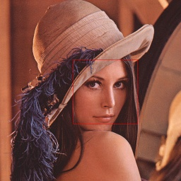
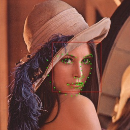

## Sample of face/facial landmarks detection 

### Preparation
- Download [trainedfile.zip](https://oskit-my.sharepoint.com/:u:/g/personal/yoshiyuki_kamakura_oit_ac_jp/EQzYzqnBcFdGvyDWooZESeIBGTP8bVaCJNiOQvCnTBGuKg?e=bmXtHn) and unzip the ZIP files. 
- `haarcascade_frontalface_default.xml` should be saved in `code` folder.
    - It's a trained dataset file that is provieded by [OpenCV](https://github.com/opencv) to detect the faces with the Haarcascade.
- `lbfmodel.ymal` should be saved in `code` folder.
    - It's a trained dateset file that is provieded by [kurnianggoro](https://github.com/kurnianggoro) to detect the facial landmarks with the LBF(Local binary fitting) model.

### cvface_detection.py
```python
# Sample of face detection 
# -*- coding: utf-8 -*-
import cv2

# main--------------------------------------------------------------------------------------
def main():  
    cascade = cv2.CascadeClassifier("./haarcascade_frontalface_default.xml")

    img = cv2.imread('./imgs/lena.jpg')
    faces = cascade.detectMultiScale(img)

    for i, face in enumerate(faces):
        fx, fy, fw, fh = face
        cv2.rectangle(img, (fx, fy), (fx+fw, fy+fh), [0,0,255], 1)

    cv2.imshow("face", img)
    
    cv2.waitKey(0)
    cv2.destroyAllWindows()

# run---------------------------------------------------------------------------------------
if __name__ == '__main__':
    main()
```

### face detection properties
- It's a face detection program using Haar Cascade.
    - You can see the theory of Haar Cascade [here](https://docs.opencv.org/4.5.2/db/d28/tutorial_cascade_classifier.html). 
    - The following line is in order to prepare the face detection by reading a trained dataset `haarcascade_frontalface_default.xml`.
        ```python
        cascade = cv2.CascadeClassifier("./haarcascade_frontalface_default.xml")
        ```
    - The following line is in order to detect the faces in the image which is set in the argument.
        ```python
        faces = cascade.detectMultiScale(img)
        ```
    - The returned value of `cascade.detectMultiScale(img)` is an array which is listed the detected faces.
    - `faces` array consists of the elements which have the parameters of each detected face area.
    - The values of each element in `faces` array are consist of the x and y coordinates of upper-left, the width and height, for the area of the detected face. <br>
         ```
         face[i] = [x, y, width, height]
         faces = [face[0], face[1], face[2], ...]
         ```
    
    - You can see the arguments and more details of `cv2.CascadeClassifier()` and `detectMultiScale()` [here](https://docs.opencv.org/master/d1/de5/classcv_1_1CascadeClassifier.html).

### Tips on OpenCV
- The following line in `cvface_detection.py` is to be able to extract the element (`face`) in order from `faces` array along with the index number (`i`).
    ```python
    for i, face in enumerate(faces):
    ```
    - It can extract only each element (`face`) if the for loop is written without `enumerate()` function.
        ```python
        for face in faces:
        ```
    
- The following line in `cvface_detection.py` is in order to draw the rectangle on the image.
    ```python
    cv2.rectangle(img, (fx, fy), (fx+fw, fy+fh), [0,0,255], 1)
    ```
    | argument | comment |
    :--- | :---
    | img | The image to draw the rectangle. |
    | (fx, fy) | The x and y coordinates of the upper-left corner of the rectangle. |
    | (fx+fw, fy+fh) | The x and y coordinates of the lower-right corner of the rectangle. |
    | \[0,0,255\] | The line color of the rectangle. It's represented by the values of BGR color components. |
    | 1 | The line width of the rectangle. The rectangle is filled in with the color if its value sets -1. |

### :o:Practice
- You should be copy [`cvface_detection.py`](#cvface_detectionpy) with the `clipboard` button and paste it to the VS Code, and save it as `cvface_detection.py` in the `code` folder.
- Check it can detect the face on Lenna's face.<br>
        
- The program is terminated with any key press.


### cvfacemark_detection.py
```python
# Sample of facial landmarks detection 
# -*- coding: utf-8 -*-
import cv2

# main--------------------------------------------------------------------------------------
def main():  
    cascade = cv2.CascadeClassifier("./haarcascade_frontalface_default.xml")
    lbf = cv2.face.createFacemarkLBF()
    lbf.loadModel("lbfmodel.yaml")

    img = cv2.imread('./imgs/lena.jpg')
    faces = cascade.detectMultiScale(img)
    
    for i,face in enumerate(faces):
        fx, fy, fw, fh = face
        cv2.rectangle(img, (fx, fy), (fx+fw, fy+fh), [0,0,255], 1)
        landmarks = lbf.fit(img, faces)
        _, list = landmarks

        for x, y in list[i][0]:
            cv2.circle(img, (int(x), int(y)), 2,(0,255, 0), -1)

    cv2.imshow("face+facemark", img)

    cv2.waitKey(0)
    cv2.destroyAllWindows()

# run---------------------------------------------------------------------------------------
if __name__ == '__main__':
    main()
```

### facial landmarks detection properties
- It's a facial landmarks detection program using LBF(Local binary fitting).
    - You can see the theory of LBF [here](https://github.com/kurnianggoro). 
    - The following line in `cvfacemark_detection.py` is in order to prepare to use the LBF model, and to read a trained dataset `lbfmodel.yaml`.
        ```python
        lbf = cv2.face.createFacemarkLBF()
        lbf.loadModel("lbfmodel.yaml")
        ```
    - The following line in `cvfacemark_detection.py` is in order to detect the facial landmarks around the face area in the image, which are set in the argument.
        ```python
        landmarks = lbf.fit(imgs, faces)
        ```
    - The following line in `cvfacemark_detection.py` is in order to extract the coordinates of the landmarks on each face as the list.
        ```python
        _, list = landmarks
        ```
    - It's defined that 68 facial landmarks are mapped on the face like [here](https://www.researchgate.net/figure/The-68-specific-human-face-landmarks_fig4_331769278).
    - You can extract all landmarks on each face like the following.
        ```python
        for x, y in list[i][0]:
        ```
    - You can extract the specific landmark like the following. It's an example to extract the No.10.
        ```python
        x, y = list[i][0][10]
        ```
        
### Tips on OpenCV
    
- The following line in `cvfacemark_detection.py` is in order to draw the circle on the image.
    ```python
    cv2.circle(img, (x, y), 5,(255,255, 0), -1)
    ```
    | argument | comment |
    :--- | :---
    | img | The image to draw the circle. |
    | (x, f) | The x and y coordinates of the center of the circle. |
    | 5 | The radius of the circle. |
    | (255, 255, 0) | The line color of the circle. It's represented by the values of BGR color components. |
    | -1 | The line width of the circle. The circle is filled in with the color if its value sets -1. |

### :o:Practice
- You should be copy [`cvfacemark_detection.py`](#cvfacemark_detectionpy) with the `clipboard` button and paste it to the VS Code, and save it as `cvfacemark_detection.py` in the `code` folder.
- Check it can detect the face and facial landmarks on Lenna's face.<br>
    
- The program is terminated with any key press.

### :o:Checkpoint (Sample of face/facial landmarks detection)
- It's OK, you can run the program of face/facial landmarks detection.

## Sample of the face/facial landmarks detection on the video-image

### cvfacemark_video.py

```python
# -*- coding: utf-8 -*-
import cv2
import numpy as np
import time

device = 0 # camera device number

# added function -----------------------------------------
def getFrameNumber(start:float, fps:int):
    now = time.perf_counter() - start
    frame_now = int(now * 1000 / fps)

    return frame_now

# main--------------------------------------------------------------------------------------
def main():  
    global device

    cascade = cv2.CascadeClassifier("./haarcascade_frontalface_default.xml")
    lbf = cv2.face.createFacemarkLBF()
    lbf.loadModel("lbfmodel.yaml")

    cap = cv2.VideoCapture(device)
    fps = cap.get(cv2.CAP_PROP_FPS)
    wt  = cap.get(cv2.CAP_PROP_FRAME_WIDTH)
    ht  = cap.get(cv2.CAP_PROP_FRAME_HEIGHT)

    print("Size:", ht, "x", wt, "/Fps: ", fps)

    start = time.perf_counter()
    frame_prv = -1
    while cap.isOpened() :
        frame_now=getFrameNumber(start, fps)
        if frame_now == frame_prv:
            continue
        frame_prv = frame_now

        ret, frame = cap.read()

        faces = cascade.detectMultiScale(frame)
    
        if len(faces)>0:
            face = faces[0]
            fx, fy, fw, fh = face
            cv2.rectangle(frame, (int(fx), int(fy)), (fx+fw, fy+fh), [0,0,255], 0)
            landmarks = lbf.fit(frame, np.array([face]))
            _, list = landmarks

            for x, y in list[0][0]:
                cv2.circle(frame, (int(x), int(y)), 2,(0,255, 0), -1)

        if cv2.waitKey(1) & 0xFF == 27:
            break
        cv2.imshow("video", frame)

    cv2.destroyAllWindows()
    cap.release()

# run---------------------------------------------------------------------------------------
if __name__ == '__main__':
    main()
```
- This program is combined [`video_viewer2.py`](#video_viewer2py) with [`cvfacemark_detection.py`](#cvfacemark_detectionpy).
- This program is changed to be able to detect only one person in the video. You can check that in the following.
    - face detection for one perspn
        ```python
        if len(faces)>0:
            face = faces[0]
            fx, fy, fw, fh = face
        ```
    - facial landmarks detection for one perspn
        ```python
        for x, y in list[0][0]:
        ``` 
- Sometimes, the results of the detections not good because the face detection time with haar cascade would be longer than the FPS.

### :o:Practice
- You should be copy [`cvfacemark_video.py`](#cvfacemark_videopy) with the `clipboard` button and paste it to the VS Code, and save it as `cvfacemark_video.py` in the `code` folder.
- Check it can detect the face and facial landmarks on the face in the video-image.
- The program is terminated with `Esc` key press.

### :o:Checkpoint (Sample of the face/facial landmarks detection on the video-image)
- It's OK, you can run the program of face/facial landmarks detection on the video-image.

